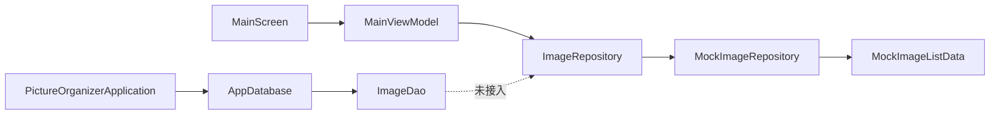
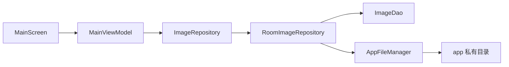

# 架构设计

> 「图片整理」App 技术架构说明。版本矩阵见 [项目式样说明书.md](项目式样说明书.md) §3.1；包结构约定见 [shared/rules/dev-convention.md](../shared/rules/dev-convention.md)。

## 1. 总览

| 层级 | 选型 |
|------|------|
| 界面 | 单 Activity + Jetpack Compose + Material 3 |
| 导航 | Navigation Compose（`splash` → `main`） |
| 状态管理 | MVVM（`*UiState` / `*UiEvent` / `*UiEffect`） |
| 数据访问 | Repository 模式 |
| 持久化 | Room 2.7.2（已初始化，**当前 UI 仍读 Mock**） |
| 文件 / 图片 | `util/` 工具类（空架子，待实现） |

全程本地运行，不联网。

## 2. 包结构

```
com.pictureorganizer/
├── PictureOrganizerApplication.kt   # Application；懒加载 AppDatabase
├── MainActivity.kt
├── navigation/                      # Routes、NavHost
├── model/                           # 领域 / UI 模型（无 Room @Entity）
│   ├── ImageListItem.kt
│   └── ImageStatus.kt
├── data/
│   ├── repository/                  # ImageRepository、MockImageRepository
│   ├── local/                       # Room：Entity、DAO、Database、Converter
│   │   ├── entity/ImageEntity.kt
│   │   ├── dao/ImageDao.kt
│   │   ├── converter/Converters.kt
│   │   └── AppDatabase.kt
│   └── mock/                        # MockImageListData（假数据种子）
├── util/
│   ├── file/AppFileManager.kt       # 私有目录文件操作（待实现）
│   └── image/ImageManager.kt        # 图片读取 / 压缩 / 缩略图（待实现）
└── ui/
    ├── splash/
    ├── main/                        # MainViewModel、MainScreen、tab/
    └── theme/
```

## 3. 数据流

### 3.1 当前（v0.7）



- `MainScreen`：纯 UI，收集 `MainUiState`、发送 `MainUiEvent`、处理 `MainUiEffect`
- `MainViewModel`：Tab 切换、编辑模式、批量改状态；通过 `ImageRepository` 读写列表
- `MockImageRepository`：内存三列表（待处理 / 已确认 / 不修改），种子来自 `MockImageListData`
- Room 已在 Application 启动时可建库，**尚未替换 Mock**

### 3.2 目标（后续）



## 4. Room 设计（v1 骨架）

### 4.1 数据库

| 项 | 值 |
|---|---|
| 类 | `AppDatabase` |
| 文件名 | `picture_organizer.db` |
| 版本 | 1 |
| 初始化 | `PictureOrganizerApplication.database`（lazy） |

### 4.2 表 `images`（`ImageEntity`）

| 字段 | 类型 | 说明 |
|------|------|------|
| `id` | String (PK) | 图片唯一 ID |
| `filePath` | String | 私有目录内相对或绝对路径 |
| `fileName` | String | 文件名 |
| `description` | String | 描述 |
| `status` | String | 整理状态（与 `ImageStatus` 枚举对应） |
| `importedAt` | Long | 导入时间戳 |
| `tagsJson` | String | 标签 JSON / 分隔串（**过渡方案**，标签体系待定） |

### 4.3 DAO（占位）

- `observeByStatus(status: String): Flow<List<ImageEntity>>` — 按状态观察列表
- `insert(entity: ImageEntity)` — 插入 / 替换

### 4.4 标签过渡方案

标签体系尚未定稿（见式样书 §7）。当前 `tagsJson` 单列存储；定稿后可 Migration v2 拆为 `tags` + `image_tags` 关联表。

### 4.5 Entity ↔ UI 模型

- Room Entity 在 `data/local/entity/`
- 列表展示用 `model/ImageListItem`（含 `placeholderColorArgb` 等 UI 字段）
- 后续在 `data/mapper/` 或 Repository 内实现 `ImageEntity` → `ImageListItem` 映射

## 5. 工具类职责（空架子）

| 类 | 包 | 后续职责 |
|---|---|---|
| `AppFileManager` | `util/file/` | 私有目录路径、URI 复制导入、重命名、删除、按标签 zip 导出 |
| `ImageManager` | `util/image/` | 读取尺寸、按阈值压缩、生成缩略图 |

压缩阈值具体数值：待定（式样书 §4.2）。

## 6. 后续迭代顺序

1. `RoomImageRepository` 替换 `MockImageRepository`（ViewModel 构造函数注入）
2. `AppFileManager` — 从系统相册 / 文件选择器复制到私有目录
3. `ImageManager.compressIfNeeded()` — 阈值定稿后实现
4. Repository 返回 `Flow<List<ImageListItem>>`，替代 ViewModel 内手动 `refreshLists()`
5. 标签体系定稿 → Room Migration v2
6. 单张图片操作画面、真实缩略图加载

## 7. 开发记录

| 日期 | 变更 |
|---|---|
| 2026-08-27 | 初版：MVVM + Repository + Room v1 骨架 + util 空架子 |
