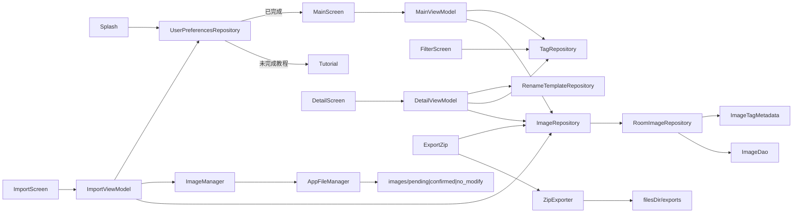

# 架构设计

> 「图片整理」App 技术架构说明。版本矩阵见 [项目式样说明书.md](../式样/项目式样说明书.md) §3.1；**包结构以本节 §2 为准**（常驻规则 `shared/rules/dev-convention.md` 仅引用至此，不展开）。完整 route 见 [路由设计.md](路由设计.md)。

## 1. 总览

| 层级 | 选型 |
|------|------|
| 界面 | 单 Activity + Jetpack Compose + Material 3 |
| 导航 | Navigation Compose（`splash` → `tutorial`/`main`；主流程另含 import / detail / settings / filter / export-zip 等，见路由表） |
| 状态管理 | MVVM（`*UiState` / `*UiEvent` / `*UiEffect`） |
| 数据访问 | Repository 模式 |
| 持久化 | Room 2.7.2（v4：`images`（含 `originalName`）+ `tags` + `tag_templates` + `rename_templates`） |
| 偏好 | DataStore Preferences（教程完成、默认标签、导入压缩开关、导入重名询问开关） |
| 文件 / 图片 | `AppFileManager` / `ImageManager` / `ImageTagMetadata` / `ImportDuplicateLogic` / `ZipExporter` / `RenamePatternApplier` |
| 图片加载 | Coil（列表缩略图 + 详情主图） |
| 分享 | `FileProvider`（`exports/`） |

全程本地运行，不联网。

## 2. 包结构

根包：`android/app/src/main/java/com/pictureorganizer/`。

### 2.1 目录树

```
com.pictureorganizer/
├── PictureOrganizerApplication.kt
├── MainActivity.kt
├── navigation/                 # Routes、NavHost、FilterResultKeys
├── model/
│   ├── ImageListItem.kt / ImageStatus.kt
│   ├── Tag.kt / TagTemplate.kt / RenameTemplate.kt
│   └── TagFilterCriteria.kt
├── data/
│   ├── repository/             # Image / Tag / RenameTemplate / UserPreferences；Room* / Mock*
│   ├── mapper/                 # ImageMappers、TagMappers（含 RenameTemplate）
│   ├── local/                  # Entity、DAO、Migration、AppDatabase
│   └── mock/
├── util/
│   ├── file/                   # AppFileManager、ZipExporter、RenamePatternApplier、PendingOrphanCleaner
│   └── image/                  # ImageManager、ImageTagMetadata、ImportDuplicateLogic
└── ui/
    ├── splash/ / tutorial/
    ├── main/ / filter/
    ├── importimages/ / imagedetail/
    ├── settings/ / tagmanage/
    ├── renametemplate/ / defaulttags/
    ├── exportzip/
    ├── osslicenses/
    └── theme/
```

### 2.2 放置约定

| 内容 | 位置 |
|---|---|
| 画面 Composable | `ui/<screen>/`（纯 UI，无业务逻辑） |
| 画面逻辑 | `ui/<screen>/<Screen>ViewModel.kt` + `*UiState` / `*UiEvent` |
| 领域 / UI 模型 | `model/`（无 Android 框架依赖为佳） |
| 数据访问 | `data/repository/` |
| Room 持久化 | `data/local/`（Entity、DAO、Database、Converter） |
| Entity ↔ UI 映射 | `data/mapper/` |
| 假数据种子 | `data/mock/`（开发期保留，Preview / 测试） |
| 文件 / 图片等无 UI 工具 | `util/` |
| route 常量 | `navigation/Routes.kt`（集中定义） |

## 3. 数据流

### 3.1 当前



主画面列表：**全量** `observeItems(status)` Flow + `TagRepository.observeTags()` → `MainViewModel` 内按用户标签筛选（OR +「未打标签」）再按页切片（每页 30）；不引入 Paging3。筛选条件在独立画面 `filter` 配置，经 `SavedStateHandle`（`FilterResultKeys`）回传；主画面菜单展示摘要 Chip。打包画面复用同一筛选模型。

启动：`splash` 读 `UserPreferencesRepository` → 未完成教程进 `tutorial`，否则进 `main`；首次完成/跳过教程写入 `tutorial_completed`。设置内重看教程（`fromSettings=true`）**不**改写完成标记，结束后 `popBackStack`。

各画面详细数据依赖见对应 `docs/画面/<画面>/README.md`。

### 3.2 导入流程

相册 / 文件多选 → 读压缩开关与默认标签 → **F7** 压缩前从源 Uri 读 Exif `UserComment` 用户标签 → `ImageManager.prepareForImport(uri, compressEnabled)`（关压缩则原样复制）→ 落盘 `pending/` → `ImageRepository.insert`（Pending，`tagsJson` = 默认标签 ∪ Exif 回读去重）→ 回读/默认标签进词表（对齐 S2）→ **F10** Snackbar 完成提示并**停留**导入画面（不自动 pop；用户自行返回）

进入导入画面时：**F10** 扫描 `pending/`，删除 DB 无记录的孤儿文件（`PendingOrphanCleaner` + `AppFileManager.cleanupPendingOrphans`）。

### 3.3 移动 / 删除

- **移动到**：物理文件迁入目标子目录 + 更新 `status` / `filePath`（S1：状态不写入标签）
- **删除**（回收站 Tab）：删私有文件 + `deleteByIds`

### 3.4 详情：重命名 / 标签

- **重命名**：同状态目录 `renameInPlace` + 更新 `fileName` / `filePath` / `description`；可套用 `RenameTemplate`（`RenamePatternApplier`：`{name}` `{date}` `{tag}`）
- **更新标签**：写 Room `tagsJson`（仅用户标签，不注入状态标签）；用户标签写入 Exif `UserComment`（JSON）；写 Exif 失败时 DB 仍成功，UI Snackbar 提示
- **F8 删库标签**：先数引用；无引用只删词表；有引用二次确认后 `removeTagFromAllImages`（DB+Exif）再删词表；Exif 失败张数汇总提示

### 3.5 打包导出

已确认列表 →（可选）`TagFilterCriteria` → `ZipExporter` 按标签生成 zip 至 `filesDir/exports/` → FileProvider URI 系统分享

### 3.6 启动迁移

`PictureOrganizerApplication.onCreate` 调用 `migrateFlatPathsIfNeeded()`：确保三子目录存在；将旧扁平 `filePath`（无 `/`）按 `status` 迁入对应子目录并更新库；同时幂等剔除存量 `tagsJson` 中残留的状态词（S1）。

## 4. Room 设计（v3）

### 4.1 数据库

| 项 | 值 |
|---|---|
| 类 | `AppDatabase` |
| 文件名 | `picture_organizer.db` |
| 版本 | **3**（Migration `1→2` 建 `tags` / `tag_templates`；`2→3` 建 `rename_templates`） |
| 初始化 | `PictureOrganizerApplication.database`（lazy） |

### 4.2 表 `images`（`ImageEntity`）

| 字段 | 类型 | 说明 |
|------|------|------|
| `id` | String (PK) | 图片唯一 ID |
| `filePath` | String | 相对 `images/` 的路径，如 `pending/{id}.jpg` |
| `fileName` | String | 显示用文件名 |
| `description` | String | 描述 |
| `status` | String | Pending / Confirmed / NoModify |
| `importedAt` | Long | 导入时间戳 |
| `tagsJson` | String | JSON 数组字符串（`org.json`）；**仅存用户标签**，与标签库无外键 |
| `originalName` | String? | **F11**：导入时 Uri `DISPLAY_NAME`；历史行 null，不参与判重 |

### 4.3 表 `tags`（标签库）

| 字段 | 类型 | 说明 |
|------|------|------|
| `id` | String (PK) | 标签 ID |
| `name` | String | 显示名（**唯一**） |
| `sortOrder` | Int | 排序 |
| `createdAt` | Long | 创建时间 |

### 4.4 表 `tag_templates`（标签模板）

| 字段 | 类型 | 说明 |
|------|------|------|
| `id` | String (PK) | 模板 ID |
| `name` | String | 模板名 |
| `tagNamesJson` | String | 标签**名**字符串 JSON 数组（非外键） |
| `isDefault` | Boolean | 默认模板；业务上至多一个为 true |
| `sortOrder` | Int | 排序 |
| `createdAt` | Long | 创建时间 |

**对齐策略**：标签库 / 模板与 `images.tagsJson` **解耦**。删除库内标签不修改已有图片的 `tagsJson`；模板内可残留已删标签名（管理 UI 再提示）。详情从库多选 / 套用模板时写入 `tagsJson`（字符串名，无外键）。

### 4.5 表 `rename_templates`（重命名模板）

| 字段 | 类型 | 说明 |
|------|------|------|
| `id` | String (PK) | 模板 ID |
| `name` | String | 模板显示名 |
| `pattern` | String | 模式串，占位符 `{name}` `{date}` `{tag}` |
| `isDefault` | Boolean | 默认模板；业务上至多一个为 true |
| `sortOrder` | Int | 排序 |
| `createdAt` | Long | 创建时间 |

### 4.6 DAO

- Image：`observeByStatus` / `getByStatus` / `observeById` / `insert` / `insertAll` / `deleteByIds` / `findById` / `getAll` / **F11** `getStoredOriginalNames`
- Tag / TagTemplate：`observeAll`、`insert`、`update`、`deleteById`、`findByName` 等
- RenameTemplate：`observeAll`、`insert`、`update`、`deleteById`、设默认等

### 4.7 Entity ↔ UI

- `ImageMappers`：`toListItem()` / `toEntity()`
- `TagMappers`：`TagEntity` ↔ `Tag`；`TagTemplateEntity` ↔ `TagTemplate`；`RenameTemplateEntity` ↔ `RenameTemplate`

### 4.8 Repository

| 接口 / 类 | 说明 |
|---|---|
| `ImageRepository` | 图片列表 / 移动 / 删除 / 重命名 / `updateTags`；**F8** `countImagesWithTag` / `removeTagFromAllImages` |
| `TagRepository` | 标签库与标签模板 CRUD；`setDefaultTemplate` 时清除其它默认 |
| `RenameTemplateRepository` | 重命名模板 CRUD / 默认（Room v3） |
| `UserPreferencesRepository` | DataStore：`tutorial_completed`、`default_tag_names`、`import_compress_enabled`、`import_duplicate_ask_enabled`（F11，默认 true） |

## 5. 工具类与系统组件

| 类 / 组件 | 职责 |
|---|---|
| `AppFileManager` | `images/{pending,confirmed,no_modify}/`、URI 复制、跨状态搬移、同目录重命名、删除；`exportsDir()`；**F10** `cleanupPendingOrphans` |
| `PendingOrphanCleaner` | **F10**：判定 `pending/` 下无 DB 记录的孤儿文件名（纯 JVM） |
| `ImageManager` | `prepareForImport`：按开关压缩（>2MB 或长边 >1920 → JPEG 85）或原样复制后写入 `pending/` |
| `ImageTagMetadata` | 用户标签 ↔ Exif `TAG_USER_COMMENT` JSON（排除状态标签）；**F7** `mergeImportTags` / 导入前 `readUserTags` |
| `ImportDuplicateLogic` | **F11**：原图名规范化与批内/库内判重分组（纯 JVM） |
| `RenamePatternApplier` | 将重命名模板 pattern 套到当前文件名 / 日期 / 标签 |
| `ZipExporter` | 按标签分组打包 zip 到 `filesDir/exports/` |
| FileProvider | Manifest + `@xml/file_paths`，分享 `exports/` 下 zip |

## 6. 后续迭代

1. ~~真实缩略图加载~~ ✅
2. ~~单张图片操作画面~~ ✅
3. ~~C4 标签/模板表~~ ✅
4. ~~产品待办 C7–C10~~ ✅
5. ~~B3 / B5 / B6（R8 / 图标 / ktlint）~~ ✅
6. 工程质量与体验增强：见 [改动清单](../工程/票/改动清单.md)（余 **B1 / B2** 与 **P** 项）

## 7. 开发记录

| 日期 | 变更 |
|---|---|
| 2026-08-27 | 初版：MVVM + Repository + Room v1 骨架 + util 空架子 |
| 2026-08-28 | RoomImageRepository + 导入画面 + 压缩落盘；三子目录 |
| 2026-08-29 | 图片详细画面；Coil；rename / updateTags + Exif 双写 |
| 2026-08-30 | Room v2：`tags` / `tag_templates` + `TagRepository`（C4） |
| 2026-08-31 | C3 筛选分页；`filter`；C8 教程 + DataStore；C9 rename_templates v3；C10 压缩开关；C7 ZipExporter |
| 2026-08-31 | B3/B5/B6；文档对照代码同步包树 / Preferences / 工具表 |
| 2026-09-04 | F7：导入流程压缩前 Exif 回读；`mergeImportTags` |
| 2026-09-04 | F8：删库标签联动清图片 tagsJson + Exif |
| 2026-09-04 | F10：导入停留可续导；返回全程拦截；pending 孤儿清理 |
| 2026-09-05 | F11：Room v4 `originalName`；导入判重询问；设置开关 |
| 2026-09-05 | F26：`ui/osslicenses/`；aboutlibraries 开源许可画面 |
