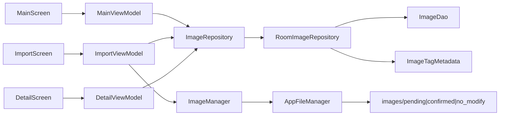

# 架构设计

> 「图片整理」App 技术架构说明。版本矩阵见 [项目式样说明书.md](../式样/项目式样说明书.md) §3.1；包结构约定见 [shared/rules/dev-convention.md](../../shared/rules/dev-convention.md)。

## 1. 总览

| 层级 | 选型 |
|------|------|
| 界面 | 单 Activity + Jetpack Compose + Material 3 |
| 导航 | Navigation Compose（`splash` → `main` ↔ `import-images` / `image-detail/{imageId}`） |
| 状态管理 | MVVM（`*UiState` / `*UiEvent` / `*UiEffect`） |
| 数据访问 | Repository 模式 |
| 持久化 | Room 2.7.2（v2：`images` + `tags` + `tag_templates`） |
| 文件 / 图片 | `AppFileManager` / `ImageManager`（导入压缩）/ `ImageTagMetadata`（Exif 标签） |
| 图片加载 | Coil（列表缩略图 + 详情主图） |

全程本地运行，不联网。

## 2. 包结构

```
com.pictureorganizer/
├── PictureOrganizerApplication.kt
├── MainActivity.kt
├── navigation/
├── model/
│   ├── ImageListItem.kt / ImageStatus.kt
│   ├── Tag.kt / TagTemplate.kt
├── data/
│   ├── repository/          # ImageRepository、TagRepository、Room*、Mock*
│   ├── mapper/              # ImageMappers、TagMappers
│   ├── local/               # Entity、DAO、Migration、AppDatabase
│   └── mock/
├── util/
│   ├── file/AppFileManager.kt
│   └── image/ImageManager.kt / ImageTagMetadata.kt
└── ui/
    ├── splash/
    ├── main/
    ├── importimages/
    ├── imagedetail/
    └── theme/
```

## 3. 数据流

### 3.1 当前



### 3.2 导入流程

相册 / 文件多选 → `ImageManager.prepareForImport`（按阈值压缩）→ 落盘 `pending/` → `ImageRepository.insert`（Pending）→ 返回 main（Flow 自动刷新）

### 3.3 移动 / 删除

- **移动到**：物理文件迁入目标子目录 + 更新 `status` / `filePath` / 状态标签
- **删除**（不修改 Tab）：删私有文件 + `deleteByIds`

### 3.4 详情：重命名 / 标签

- **重命名**：同状态目录 `renameInPlace` + 更新 `fileName` / `filePath` / `description`
- **更新标签**：`tagsForStatus` 写 Room；用户标签写入 Exif `UserComment`（JSON）；写 Exif 失败时 DB 仍成功，UI Snackbar 提示

### 3.5 启动迁移

`PictureOrganizerApplication.onCreate` 调用 `migrateFlatPathsIfNeeded()`：确保三子目录存在；将旧扁平 `filePath`（无 `/`）按 `status` 迁入对应子目录并更新库。

## 4. Room 设计（v2）

### 4.1 数据库

| 项 | 值 |
|---|---|
| 类 | `AppDatabase` |
| 文件名 | `picture_organizer.db` |
| 版本 | **2**（Migration `1→2` 建 `tags` / `tag_templates`） |
| 初始化 | `PictureOrganizerApplication.database`（lazy） |

### 4.2 表 `images`（`ImageEntity`）

| 字段 | 类型 | 说明 |
|------|------|------|
| `id` | String (PK) | 图片唯一 ID |
| `filePath` | String | 相对 `images/` 的路径，如 `pending/{id}.jpg` |
| `fileName` | String | 显示用文件名 |
| `description` | String | 描述 |
| `status` | String | Pending / Confirmed / NoModify |
| `importedAt` | Long | 导入时间戳 |
| `tagsJson` | String | JSON 数组字符串（`org.json`）；**与标签库无外键** |

### 4.3 表 `tags`（标签库）

| 字段 | 类型 | 说明 |
|------|------|------|
| `id` | String (PK) | 标签 ID |
| `name` | String | 显示名（**唯一**） |
| `sortOrder` | Int | 排序 |
| `createdAt` | Long | 创建时间 |

### 4.4 表 `tag_templates`（标签模板）

| 字段 | 类型 | 说明 |
|------|------|------|
| `id` | String (PK) | 模板 ID |
| `name` | String | 模板名 |
| `tagNamesJson` | String | 标签**名**字符串 JSON 数组（非外键） |
| `isDefault` | Boolean | 默认模板；业务上至多一个为 true |
| `sortOrder` | Int | 排序 |
| `createdAt` | Long | 创建时间 |

**对齐策略**：标签库 / 模板与 `images.tagsJson` **解耦**。删除库内标签不修改已有图片的 `tagsJson`；模板内可残留已删标签名（管理 UI 再提示）。详情（**C6**）从库多选 / 套用模板时写入 `tagsJson`（字符串名，无外键）。

### 4.5 DAO

- Image：`observeByStatus` / `getByStatus` / `observeById` / `insert` / `insertAll` / `deleteByIds` / `findById` / `getAll`
- Tag / TagTemplate：`observeAll`、`insert`、`update`、`deleteById`、`findByName` 等

### 4.6 Entity ↔ UI

- `ImageMappers`：`toListItem()` / `toEntity()`
- `TagMappers`：`TagEntity` ↔ `Tag`；`TagTemplateEntity` ↔ `TagTemplate`

### 4.7 Repository

| 接口 | 说明 |
|---|---|
| `ImageRepository` | 图片列表 / 移动 / 删除 / 重命名 / `updateTags` |
| `TagRepository` | 标签库与模板 CRUD；`setDefaultTemplate` 时清除其它默认 |

## 5. 工具类

| 类 | 职责 |
|---|---|
| `AppFileManager` | `images/{pending,confirmed,no_modify}/`、URI 复制、跨状态搬移、同目录重命名、删除 |
| `ImageManager` | 临时阈值：>2MB 或长边 >1920 → JPEG 85；导入写入 `pending/` |
| `ImageTagMetadata` | 用户标签 ↔ Exif `TAG_USER_COMMENT` JSON（排除状态标签） |

## 6. 后续迭代

1. ~~真实缩略图加载~~ ✅
2. ~~单张图片操作画面（重命名 / 加标签等）~~ ✅
3. ~~C4 标签/模板表~~ ✅
4. 产品待办 **C3、C5–C10**：见 [改动清单](../工程/改动清单.md)
5. 工程质量：见 [改动清单](../工程/改动清单.md) B（B4 备份已完成；余 B1–B3 / B5 / B6）

## 7. 开发记录

| 日期 | 变更 |
|---|---|
| 2026-08-27 | 初版：MVVM + Repository + Room v1 骨架 + util 空架子 |
| 2026-08-28 | RoomImageRepository + 导入画面 + 压缩落盘 |
| 2026-08-28 | 三子目录 + 移动搬文件 + 删除真实化 |
| 2026-08-29 | 图片详细画面；Coil；rename / updateTags + Exif 双写 |
| 2026-08-30 | 改动清单重写为 C3–C10（吸收原 C3–C5） |
| 2026-08-30 | Room v2：`tags` / `tag_templates` + `TagRepository`（C4） |
