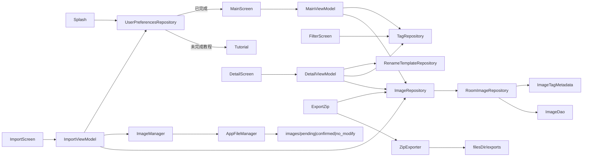

# 数据流

> **android 现状**：画面 ↔ VM ↔ Repository ↔ Room / 文件。包见 [架构设计.md](架构设计.md) §2。

| 环节 | 要点 |
|---|---|
| 启动 | `splash` → 教程标记 → `tutorial` 或 `main`；设置内重看不改完成标记 |
| 主画面 | 全量 `observeItems(status)` + `observeTags()` → VM 内筛选再分页（默认 30，无 Paging3）；筛选经 `SavedStateHandle` 回传；打包复用同一模型 |
| 导入 | 多选 → 压缩开关 / 默认标签 → Exif 回读 → `prepareForImport` → `pending/` + `insert`；进入时清无 DB 的 pending 孤儿 |
| 移动 / 删除 | 搬文件 + 改 `status`/`filePath`；回收站删除 = 删文件 + `deleteByIds` |
| 详情 | 重命名可套 `{name}` `{date}` `{yyyy}` `{mm}` `{dd}` `{time}` `{tag}` `{tags}` `{n}`；标签写 `tagsJson` + Exif；**F48** 改名原位替换（见 [Room.md](Room.md)） |
| 导出 | 已归档 →（可选筛选）→ F41 预览排除 → F42 单包名 → **一个** zip（`buildSingleExportPack`）→ `exports/` → 分享；F43/F46 历史管理 |
| 启动迁移 | `onCreate`：确保三子目录；旧扁平路径按 `status` 迁入；幂等剔 `tagsJson` 状态词 |
